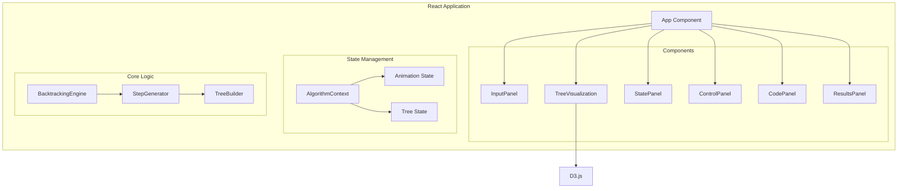

# Design Document

## Overview

组合总和算法可视化应用是一个基于 React + TypeScript + D3.js 的单页面应用，用于动态演示回溯算法解决 LeetCode 第39题的过程。应用采用组件化架构，将输入控制、树形可视化、状态展示和动画控制分离为独立模块，通过 React Context 进行状态管理。

## Architecture



## Components and Interfaces

### 1. InputPanel Component

负责用户输入的收集和验证。

```typescript
interface InputPanelProps {
  onStart: (candidates: number[], target: number) => void;
  disabled: boolean;
}

interface InputValidationResult {
  isValid: boolean;
  error?: string;
}
```

### 2. TreeVisualization Component

使用 D3.js 渲染回溯树。

```typescript
interface TreeVisualizationProps {
  treeData: TreeNode | null;
  currentNodeId: string | null;
  highlightedPath: string[];
}

interface TreeNode {
  id: string;
  value: number;           // 选择的候选数字
  remaining: number;       // 剩余和
  status: NodeStatus;      // 节点状态
  children: TreeNode[];
  depth: number;
  parent?: TreeNode;
}

type NodeStatus = 'exploring' | 'success' | 'pruned' | 'backtracked' | 'idle';
```

### 3. StatePanel Component

显示当前算法状态。

```typescript
interface StatePanelProps {
  currentPath: number[];
  remainingSum: number;
  currentCandidate: number | null;
  candidates: number[];
}
```

### 4. ControlPanel Component

动画播放控制。

```typescript
interface ControlPanelProps {
  isPlaying: boolean;
  speed: number;
  onPlay: () => void;
  onPause: () => void;
  onStep: () => void;
  onReset: () => void;
  onSpeedChange: (speed: number) => void;
  canStep: boolean;
}
```

### 5. CodePanel Component

显示算法伪代码并高亮当前行。

```typescript
interface CodePanelProps {
  currentLine: number;
}

// 伪代码行号映射
enum CodeLine {
  FUNCTION_START = 1,
  BASE_CASE_SUCCESS = 2,
  BASE_CASE_FAIL = 3,
  LOOP_START = 4,
  CHOOSE = 5,
  RECURSE = 6,
  UNCHOOSE = 7,
  RETURN = 8,
}
```

### 6. ResultsPanel Component

显示找到的所有组合。

```typescript
interface ResultsPanelProps {
  combinations: number[][];
  isComplete: boolean;
}
```

### 7. BacktrackingEngine

核心算法引擎，生成动画步骤。

```typescript
interface AlgorithmStep {
  type: StepType;
  nodeId: string;
  currentPath: number[];
  remainingSum: number;
  currentCandidate: number | null;
  candidateIndex: number;
  codeLine: CodeLine;
  treeSnapshot: TreeNode;
  foundCombination?: number[];
}

type StepType = 
  | 'start'
  | 'choose'
  | 'recurse'
  | 'found'
  | 'prune'
  | 'backtrack'
  | 'complete';

interface BacktrackingEngine {
  generateSteps(candidates: number[], target: number): AlgorithmStep[];
}
```

### 8. AlgorithmContext

全局状态管理。

```typescript
interface AlgorithmState {
  candidates: number[];
  target: number;
  steps: AlgorithmStep[];
  currentStepIndex: number;
  isPlaying: boolean;
  speed: number;
  combinations: number[][];
  treeData: TreeNode | null;
}

interface AlgorithmContextValue {
  state: AlgorithmState;
  dispatch: React.Dispatch<AlgorithmAction>;
}

type AlgorithmAction =
  | { type: 'START'; candidates: number[]; target: number }
  | { type: 'STEP_FORWARD' }
  | { type: 'PLAY' }
  | { type: 'PAUSE' }
  | { type: 'RESET' }
  | { type: 'SET_SPEED'; speed: number };
```

## Data Models

### TreeNode 数据结构

```typescript
interface TreeNode {
  id: string;              // 唯一标识符，格式: "root" | "node-{depth}-{index}"
  value: number;           // 当前节点选择的数字（根节点为0）
  remaining: number;       // 到达此节点时的剩余和
  status: NodeStatus;      // 节点当前状态
  children: TreeNode[];    // 子节点列表
  depth: number;           // 树的深度
  pathFromRoot: number[];  // 从根到此节点的路径
}
```

### AlgorithmStep 数据结构

```typescript
interface AlgorithmStep {
  type: StepType;
  nodeId: string;
  currentPath: number[];
  remainingSum: number;
  currentCandidate: number | null;
  candidateIndex: number;
  codeLine: CodeLine;
  treeSnapshot: TreeNode;  // 此步骤时的完整树状态
  foundCombination?: number[];
  description: string;     // 步骤描述文本
}
```

### 输入验证规则

```typescript
interface ValidationRules {
  candidates: {
    minLength: 1;
    maxLength: 30;
    minValue: 2;
    maxValue: 40;
    noDuplicates: true;
  };
  target: {
    minValue: 1;
    maxValue: 40;
  };
}
```


## Correctness Properties

*A property is a characteristic or behavior that should hold true across all valid executions of a system-essentially, a formal statement about what the system should do. Properties serve as the bridge between human-readable specifications and machine-verifiable correctness guarantees.*

Based on the prework analysis, the following correctness properties have been identified:

### Property 1: Input Validation Correctness

*For any* candidates array and target value, the validation function SHALL return valid=true if and only if:
- All candidates are integers between 2 and 40
- No duplicate values exist in candidates
- Candidates array length is between 1 and 30
- Target is an integer between 1 and 40

**Validates: Requirements 1.2, 1.3, 1.4**

### Property 2: Remaining Sum Invariant

*For any* algorithm step, the remainingSum SHALL equal target minus the sum of all numbers in currentPath.

```
remainingSum = target - sum(currentPath)
```

**Validates: Requirements 3.1, 3.2**

### Property 3: Node Status Correctness

*For any* algorithm step, the node status SHALL correctly reflect the algorithm state:
- When remaining = 0, status = 'success'
- When remaining < 0, status = 'pruned'
- When backtracking, status = 'backtracked'
- When exploring, status = 'exploring'

**Validates: Requirements 2.2, 2.3, 2.4, 2.5**

### Property 4: Algorithm Output Correctness

*For any* valid candidates array and target, the final combinations list SHALL contain exactly all unique combinations where:
- Each combination sums to target
- Each combination only uses numbers from candidates
- Numbers can be reused unlimited times
- No duplicate combinations exist

**Validates: Requirements 4.5**

### Property 5: Step Progression Monotonicity

*For any* step forward action, the currentStepIndex SHALL increase by exactly 1, and SHALL not exceed the total number of steps.

**Validates: Requirements 4.2**

### Property 6: Code Line Mapping Consistency

*For any* algorithm step, the codeLine SHALL correctly map to the step type:
- 'start' → FUNCTION_START
- 'choose' → CHOOSE
- 'recurse' → RECURSE
- 'found' → BASE_CASE_SUCCESS
- 'prune' → BASE_CASE_FAIL
- 'backtrack' → UNCHOOSE
- 'complete' → RETURN

**Validates: Requirements 6.2, 6.3**

### Property 7: Tree Structure Consistency

*For any* tree node, the node's remaining value SHALL equal its parent's remaining minus the node's value.

```
node.remaining = parent.remaining - node.value
```

**Validates: Requirements 2.1, 2.2**

## Error Handling

### Input Validation Errors

| Error Condition | Error Message | Recovery Action |
|----------------|---------------|-----------------|
| Empty candidates array | "请输入至少一个候选数字" | 保持输入焦点 |
| Candidate out of range | "候选数字必须在 2-40 之间" | 高亮无效输入 |
| Duplicate candidates | "候选数字不能重复" | 高亮重复项 |
| Invalid target | "目标值必须在 1-40 之间" | 保持输入焦点 |
| Non-integer input | "请输入有效的整数" | 清除无效字符 |

### Runtime Errors

| Error Condition | Handling Strategy |
|----------------|-------------------|
| Animation timeout | 自动暂停并提示用户 |
| Tree rendering overflow | 缩放树以适应视口 |
| Step index out of bounds | 重置到有效范围 |

## Testing Strategy

### Unit Testing

使用 Vitest 进行单元测试：

1. **Validation Functions**
   - 测试有效输入返回 valid=true
   - 测试各种无效输入返回正确错误信息

2. **BacktrackingEngine**
   - 测试已知输入的步骤生成
   - 测试边界情况（单元素数组、无解情况）

3. **TreeBuilder**
   - 测试树节点创建
   - 测试节点状态更新

4. **Reducer Functions**
   - 测试各种 action 的状态转换

### Property-Based Testing

使用 **fast-check** 库进行属性测试：

1. **Property 1: Input Validation**
   - 生成随机数组和目标值
   - 验证验证函数的正确性

2. **Property 2: Remaining Sum Invariant**
   - 生成随机有效输入
   - 对每个生成的步骤验证不变量

3. **Property 3: Node Status Correctness**
   - 生成随机步骤序列
   - 验证节点状态与步骤类型的对应关系

4. **Property 4: Algorithm Output Correctness**
   - 生成随机有效输入
   - 验证输出组合的正确性

5. **Property 5: Step Progression**
   - 生成随机步进序列
   - 验证索引单调递增

6. **Property 6: Code Line Mapping**
   - 生成随机步骤
   - 验证代码行映射

7. **Property 7: Tree Structure**
   - 生成随机树
   - 验证父子节点关系

### Test Configuration

```typescript
// vitest.config.ts
export default defineConfig({
  test: {
    environment: 'jsdom',
    globals: true,
    setupFiles: ['./src/test/setup.ts'],
  },
});

// Property test configuration
fc.configureGlobal({
  numRuns: 100,  // 每个属性测试运行100次
});
```

## UI Layout

```
+------------------------------------------------------------------+
|                        Input Panel                                |
|  Candidates: [2,3,6,7]    Target: [7]    [Start] [Reset]         |
+------------------------------------------------------------------+
|          |                                    |                   |
|  Code    |        Tree Visualization          |    State Panel   |
|  Panel   |                                    |                   |
|          |            [Root: 7]               |  Current Path:   |
|  func()  |           /    |    \              |  [2, 2]          |
|  > if    |         [2]   [3]   [6]            |                   |
|    for   |        / | \                       |  Remaining: 3    |
|    ...   |      [2][3][6]                     |                   |
|          |                                    |  Candidate: 3    |
|          |                                    |                   |
+----------+------------------------------------+-------------------+
|                      Control Panel                                |
|  [Play] [Pause] [Step] [Reset]    Speed: [====o====] 1.0x        |
+------------------------------------------------------------------+
|                      Results Panel                                |
|  Found Combinations: [[2,2,3], [7]]                              |
+------------------------------------------------------------------+
```

## Technology Stack

- **React 18**: UI 框架
- **TypeScript**: 类型安全
- **D3.js v7**: 树形可视化
- **Vite**: 构建工具
- **Vitest**: 单元测试
- **fast-check**: 属性测试
- **CSS Modules / Tailwind CSS**: 样式管理
